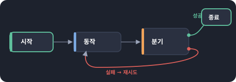
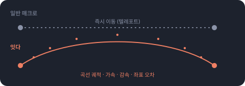

# IT-DA (잇다)

*[한국어](README.md)*

A flowchart-based **situation-aware** macro tool. Windows desktop only.

Not a macro that blindly replays fixed coordinates. **It judges what's on
screen right now, and if that's not the screen it needs, it navigates there
first before acting.** A flowchart editor for wiring nodes into a flow,
multi-flow execution running several macros at once, and human-like input
motion — all in one macro that looks at the screen and decides how to move.

## 📖 [View the user guide](https://sallyhadev.github.io/IT-DA/)

A full guide with real screenshots and concept diagrams. (This is
[`docs/index.html`](docs/index.html) from this repo, served as-is via
GitHub Pages.)

## Download

Grab the latest zip from [Releases](../../releases/latest), unzip it, and
run `itda.exe`. No Python installation required.

> **If clicks or key input don't register, try running as administrator.**
> Windows blocks a lower-privilege program from sending input to a window
> running with administrator privileges (some games, security software,
> etc.) — this is UIPI. If your target program runs as administrator, you
> must also right-click `itda.exe` → **Run as administrator** for IT-DA.

### OCR (text reading) — Tesseract must be installed separately

To use the `Read text (OCR)` action, install
[Tesseract OCR (UB-Mannheim build)](https://github.com/UB-Mannheim/tesseract/wiki)
separately. [Direct download for the Windows 64-bit installer](https://digi.bib.uni-mannheim.de/tesseract/tesseract-ocr-w64-setup-5.3.3.20231005.exe)

- During install, **make sure to check `Korean` under "Additional language
  data"** — it's unchecked by default, and without it Korean text won't be
  recognized.
- Installing to the default path (`C:\Program Files\Tesseract-OCR`) lets
  IT-DA find it automatically. If you installed elsewhere, set the
  `ITDA_TESSERACT` environment variable to the full path of `tesseract.exe`.
- If Tesseract isn't installed, running an OCR action just logs an install
  notice — everything else keeps working normally.

## Features

- **Build with a flowchart** — connect nodes such as start, action, branch,
  multi-branch, loop, and flow-call to define order, and stack actions like
  click or find-image inside each node.

  

- **Recognizes the situation** — register detection conditions (image,
  window title, pixel, OCR) for each screen, and the engine judges what
  situation you're in right now and takes the shortest path to the one it
  needs. It also automatically clears "interrupting screens" like ad
  pop-ups and returns to what it was doing.
- **Runs multiple flows at once** — each flow runs in its own thread and
  engine, with separate variables and situation detection. Only genuinely
  singular input devices like the mouse and keyboard are time-shared by
  priority.
- **Preview before running** — `F5` demo playback simulates the flow and
  the log/variable changes without any real input. `F8` inspection catches
  problems like broken connections or circular calls ahead of time.
- **Moves like a human** — curved trajectories, acceleration/deceleration,
  and coordinate/timing jitter can be toggled on or off via a profile.

  

## Building your first macro

1. **Build a flow** — drag nodes from the palette and connect them. The
   first node is usually `Fit window` (locks the target window to a fixed
   size so coordinates don't drift).
2. **Save targets as objects** — one at a time with the `F3` screenshot
   tool, or all at once with the `F4` objectify tool, which auto-splits the
   screen into icons/text/buttons.
3. **`F8` inspection** — catches missing object/flow references, circular
   calls, and similar issues ahead of time.
4. **`F5` demo playback** — check the flow and plan (coordinates,
   trajectory, timing) in the log, without any real input.
5. **`F9` real run** — acts with the actual mouse and keyboard. Use `F10`
   to run multiple flows at once.

> **How to stop: `F12`.** A global shortcut that works even when the IT-DA
> window is in the background. Since a running macro may be holding the
> mouse, this is worth remembering — the stop button can be hard to reach.

## Layout

| Area | Contents |
|---|---|
| Center | Flowchart canvas (edit multiple flows at once via tabs) |
| Left | Project (flow list) / Palette (nodes & actions) / Object store |
| Right | Node action list / Properties (auto-generated schema form) |
| Bottom | Log / Run status (current situation badge + variable watch) |

Shortcuts: `F2` coordinate tool · `F3` screenshot tool · `F4` objectify tool
· `F5` demo playback · `F6` situation manager · `F7` timing profile ·
`F8` inspection · `F9` real run · `F10` multi-flow run · `F11` situation
watch · `F12` stop run · `Ctrl+L` auto-layout · `Ctrl+0` fit to view

See the **[user guide](https://sallyhadev.github.io/IT-DA/)** for details
on each screen.

## Development

See **[CONTRIBUTING.md](CONTRIBUTING.md)** for running/building from
source, understanding the code structure, or adding new actions.
